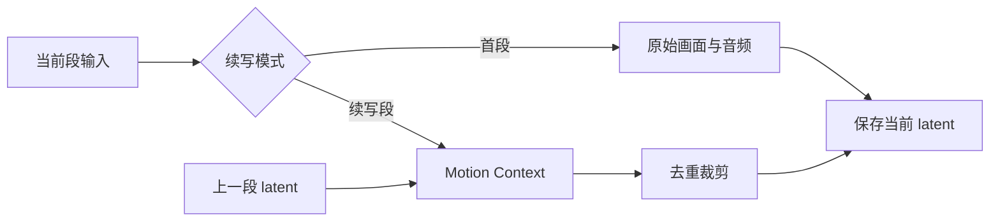

<div align="center">

# motion-context-hybird

**把分散的 H3 Motion Context 续写链路收进一个可检查的 ComfyUI 原生子图。**

[为什么使用](#为什么使用) · [快速开始](#快速开始) · [节点接口](#节点接口) · [设计](#设计) · [限制](#限制)

[](https://github.com/comfyanonymous/ComfyUI)
[](https://www.python.org/)
[](LICENSE)

</div>

MiniMax H3 的多段续写通常需要同时管理 latent 加载、Motion Context 应用、重复帧裁剪、音频裁剪、路径拼接和 latent 保存。`motion-context-hybird` 将这组已有节点转换为一个 ComfyUI 原生 Subgraph，让主画布只保留续写时真正需要调整的参数。

仓库只提供转换工具，不附带任何完整工作流。你的模型、提示词、采样器和输出设置都留在自己的工作流中。

## 为什么使用

| 原始链路 | 转换后 |
| --- | --- |
| 多个节点分散在主画布 | 一个 `Motion Context 一键续写` 子图 |
| 首段和续写段需要手动切换多处分支 | 一个“续写模式”开关 |
| 画面与音频裁剪参数分散 | 常用参数集中在主节点 |
| 调试时难以兼顾整洁和可见性 | 双击子图即可检查全部内部节点 |



## 快速开始

```bash
git clone https://github.com/saber080420-create/motion-context-hybird.git
cd motion-context-hybird
python tools/build_motion_context_subgraph.py source.json output.json
```

先在 ComfyUI 中保存自己的工作流 JSON。工具不会改写源文件；成功后，将 `output.json` 拖回 ComfyUI。

- 第一段：关闭 `续写模式（首段关闭）`，填写项目名称和本段编号。
- 后续段：开启续写模式，填写上一段编号和本段编号。
- 同一组片段保持项目名称一致。

## 节点接口

| 参数 | 用途 |
| --- | --- |
| 续写模式 | 首段关闭，第二段起开启 |
| 项目名称 | 组织同一项目的 latent 路径 |
| 上一段编号 | 选择需要继承的 Clip |
| 本段编号 | 保存当前段 latent |
| 画面继承帧数 | 控制视觉继承长度 |
| 音频继承帧数 | 控制重复音频裁剪长度 |
| 帧率 | 用于画面与音频对齐 |
| 从尾部匹配 | 从上一段结尾寻找衔接内容 |

首段关闭续写时不会加载历史 latent，但仍会保存当前 latent，供第二段使用。

## 设计

项目使用 ComfyUI 原生 Subgraph，不重新实现 MiniMax H3 Motion Context：

- 原始工作节点仍保留在子图内部。
- 主画布只暴露高频参数和必要输入输出。
- 通过惰性开关跳过首段不需要的续写分支。
- 画面与音频按同一段落边界裁剪。
- 源 JSON 始终保留，输出写入新文件。

实现细节见 [docs/architecture.md](docs/architecture.md)。

## 依赖

转换前的工作流需要已经包含项目所识别的节点拓扑，包括 `MiniMaxH3MotionContext`、Motion Context latent 加载与保存节点、画面和音频裁剪节点，以及 ComfyUI 原生 `ComfySwitchNode`。转换工具本身只使用 Python 标准库。

## 限制

- 当前转换器面向本项目开发时使用的 Motion Context 节点布局，依赖对应节点类型、端口和节点 ID。
- 不同版本的 H3 自定义节点若改变端口顺序，需要同步调整映射。
- 项目不包含模型、完整工作流或生成算法。
- latent 视频反查与覆盖保护已经移至独立项目 [ComfyUI-H3-Latent-Manager](https://github.com/saber080420-create/ComfyUI-H3-Latent-Manager)。

## 版本记录

见 [CHANGELOG.md](CHANGELOG.md)。

## License

[MIT](LICENSE)
